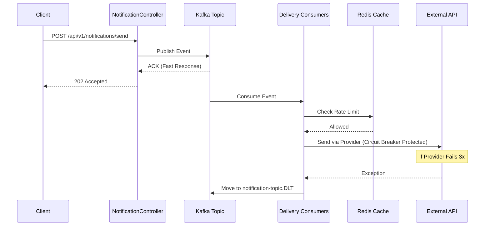

# High-Scale Event-Driven Notification Engine

A robust, distributed notification system built with **Spring Boot 3**, **Apache Kafka**, and **Redis**. This engine handles real-time "Fan-out" delivery across multiple channels (SMS, Email, Push) with built-in fault tolerance and rate limiting.


## 🚀 Key Features

* **Event-Driven Fan-out:** Uses Kafka to broadcast a single notification request to multiple delivery consumers simultaneously.
* **Real-time Delivery:** Integrated with **WebSockets (STOMP)** for instant browser-based notifications.
* **Fault Tolerance:** Implements **Resilience4j Circuit Breaker** to prevent system cascading failures when external providers (SMS/Email) go down.
* **Distributed Rate Limiting:** Uses **Redis** to ensure users aren't spammed and to protect provider quotas.
* **Self-Healing DLQ:** Failed messages are automatically retried 3 times and then moved to a **Dead Letter Queue (DLT)** for manual recovery.

---

## 🏗️ Architecture & Flow

The system follows a decoupled architecture where the API producer and delivery consumers are completely independent.


## 🚦 API Documentation

### Trigger Notification Event
Accepts a notification payload and queues it for the fan-out process.

* **URL:** `http://localhost:8080/api/v1/notifications/send`
* **Method:** `POST`
* **Headers:** `Content-Type: application/json`

**Sample Request Body:**
```json
{ 
  "eventId": "SUCCESS-001", 
  "userId": "User-Nirmal", 
  "message": "Infrastructure is LIVE!", 
  "type": "PUSH", 
  "priority": "HIGH" 
}
```
## 🚦 Quick Start

###  Launch Infrastructure
Start the required services (Zookeeper, Kafka, Redis, and Kafka-UI) in detached mode:

```bash
docker-compose up -d
```
Note: Please wait a moment for the containers to initialize. Ensure zookeeper, kafka, redis_cache, and kafka-ui show a healthy status in your Docker dashboard.


### Monitor & Verify

Once the application is live, you can monitor the real-time message flow and manage Kafka topics through the web interface:
Kafka UI: http://localhost:8081

For calling the Api, you can use Postman to test the api with the above json payload to get the response with status 200OK


After going to the Kafka-ui (http://localhost:8081) , you will find Redpanda UI where all the topics informations will be listed, go to Topics in Sidebar , you will find all your notification message displayed.


