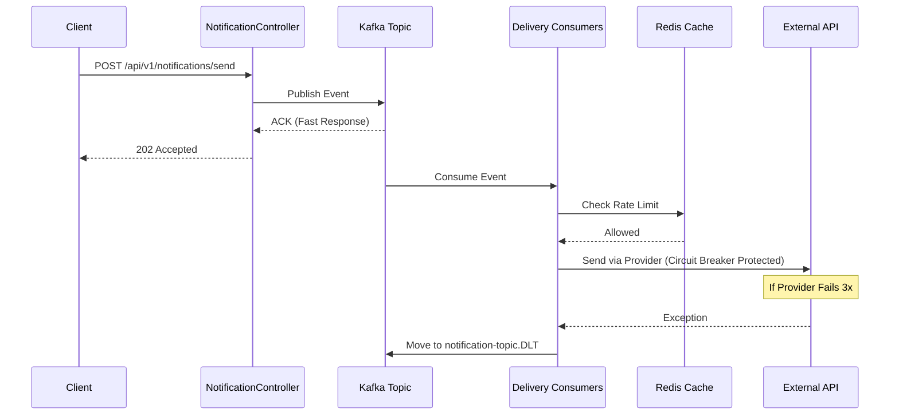

# High-Scale Event-Driven Notification Engine

A robust, distributed notification system built with **Spring Boot 3**, **Apache Kafka**, and **Redis**. This engine handles real-time "Fan-out" delivery across multiple channels (SMS, Email, Push) with built-in fault tolerance and rate limiting.

## 🚀 Key Features

* **Event-Driven Fan-out:** Uses Kafka to broadcast a single notification request to multiple delivery consumers simultaneously.
* **Real-time Delivery:** Integrated with **WebSockets (STOMP)** for instant browser-based notifications.
* **Fault Tolerance:** Implements **Resilience4j Circuit Breaker** to prevent system cascading failures when external providers (SMS/Email) go down.
* **Distributed Rate Limiting:** Uses **Redis** to ensure users aren't spammed and to protect provider quotas.
* **Self-Healing DLQ:** Failed messages are automatically retried 3 times and then moved to a **Dead Letter Queue (DLT)** for manual recovery.

---

## 🏗️ Architecture & Flow

The system follows a decoupled architecture where the API producer and delivery consumers are completely independent.

📡 API Documentation
Trigger Notification Event
Accepts a notification payload and queues it for the fan-out process.

URL: http://localhost:8080/api/v1/notifications/send

Method: POST

Success Response: 200 OK with body: Notification accepted and queued. ID: SUCCESS-001

Sample Request Body:

JSON
{
    "eventId": "SUCCESS-001",
    "userId": "User-Nirmal",
    "message": "Infrastructure is LIVE!",
    "type": "PUSH",
    "priority": "HIGH"
}

🛠️ Reliability Features
Self-Healing DLQ: Failed messages are automatically retried 3 times with a 2-second fixed backoff before being moved to notification-topic.DLT.

Distributed Rate Limiting: Leverages Redis to protect external provider quotas and prevent user spam.

Live Verification: Messages can be verified instantly via terminal using kafka-console-consumer or visually through the dashboard.

🚀 Quick Start
Launch Infrastructure:

Bash
docker-compose up -d
(Verify containers zookeeper, kafka, redis_cache, and kafka-ui are healthy).

Run Application: Launch ChatsAppApplication.java from your IDE.

Monitor: Access the UI at http://localhost:8081 to view topics and real-time message flow.

